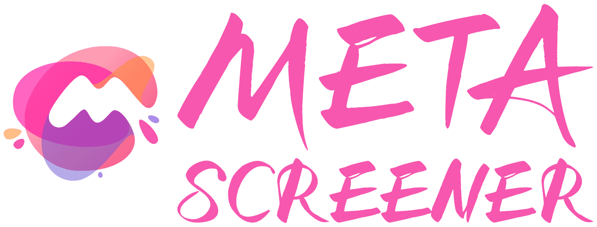

# MetaScreener
### *AI-Powered Literature Screening. Revolutionized.*

<div align="center">



<br>

**Transform weeks of manual literature screening into hours**

<br>

[](https://www.python.org/)
[](https://flask.palletsprojects.com/)
[](https://github.com/ChaokunHong/MetaScreener)

<br>
<br>

### **[✨ Start Your Journey →](https://www.metascreener.net/)**

*Research-grade accuracy • Privacy-first • Always free • Trusted by 18 institutions*

<br>

</div>

---

<br>

## Welcome to the Future of Literature Screening

<div align="center">
<sub style="color: #1fc2c2; font-size: 16px; font-weight: 500;">*Take a deep breath. Your screening workload is about to get 70% lighter.*</sub>
</div>

<br>

**The Challenge You Face:** Screening thousands of papers manually is exhausting. It takes weeks, leads to inconsistencies, and burns you out before the real research begins.

**Your Solution is Here:** MetaScreener combines cutting-edge AI with human expertise to screen literature with **95%+ accuracy** while giving you back **weeks of your life**.

<br>

### Why Researchers Choose MetaScreener

<div style="background: linear-gradient(135deg, #f0fdfa 0%, #faf5ff 100%); padding: 20px; border-radius: 12px; border-left: 4px solid #00c4b0;">

```
Human-AI Partnership    → We enhance your expertise, never replace it
Privacy First          → Your data stays secure, processing happens locally  
Lightning Fast         → Process 1000+ abstracts in under 30 minutes
Research Frameworks    → 8 validated frameworks (PICOT, SPIDER, PICOS...)
AI Flexibility        → Choose from OpenAI, Claude, Gemini, or DeepSeek
```

</div>

<br>

---

<br>

## Your MetaScreener Experience

<div align="center">
<sub style="color: #a78bfa; font-size: 16px; font-weight: 500;">*Four powerful ways to accelerate your research*</sub>
</div>

<br>

<table style="border: 2px solid #00c4b0; border-radius: 12px; overflow: hidden;">
<tr>
<td width="50%" align="center" style="background: linear-gradient(135deg, #ecfdf5 0%, #fdf4ff 100%); padding: 25px;">

### **Abstract Screening**
<span style="color: #1fc2c2; font-weight: 500;">*Your literature database → Intelligent decisions*</span>

Upload RIS file → Define criteria → Get reasoned decisions  
*Perfect for initial screening of thousands of papers*

<br>

### **Full-Text Analysis**  
<span style="color: #a78bfa; font-weight: 500;">*Deep dive into methodology and content*</span>

Upload PDFs → Extract insights → Quality assessment  
*Comprehensive evaluation with detailed reasoning*

</td>
<td width="50%" align="center" style="background: linear-gradient(135deg, #f0fdfa 0%, #faf5ff 100%); padding: 25px;">

### **Data Extraction**
<span style="color: #00c4b0; font-weight: 500;">*Transform papers into structured datasets*</span>

Define fields → Extract data → Export ready results  
*Turn literature into analyzable information*

<br>

### **Quality Assessment**
<span style="color: #8b5cf6; font-weight: 500;">*Automated methodological evaluation*</span>

Upload studies → AI evaluation → Detailed scoring  
*Built-in AMSTAR 2, Cochrane RoB 2, QUADAS-2*

</td>
</tr>
</table>

<br>

---

<br>

## Quick Start Guide

<div align="center">
<sub style="color: #1fc2c2; font-size: 16px; font-weight: 500;">*Your journey to effortless screening starts here*</sub>
</div>

<br>

<div style="background: linear-gradient(135deg, #ecfdf5 0%, #fdf4ff 100%); padding: 20px; border-radius: 12px; border: 2px solid #a78bfa;">

```
Total Time: ~17 minutes     Cost: $0.07-$1.50 per review     Success Rate: 95%+
```

</div>

<br>

### **Step 1** • Get Your AI Key *(2 minutes)*

<div align="center" style="background: linear-gradient(135deg, #f0fdfa 0%, #faf5ff 100%); padding: 25px; border-radius: 12px; border-left: 4px solid #00c4b0;">

<table style="width: 100%; border-collapse: collapse; margin: 20px 0;">
<thead>
<tr style="background: rgba(0, 196, 176, 0.1);">
<th style="padding: 15px; text-align: left; font-weight: 600; color: #00c4b0;">AI Provider</th>
<th style="padding: 15px; text-align: center; font-weight: 600; color: #00c4b0;">Cost per 100 abstracts</th>
<th style="padding: 15px; text-align: center; font-weight: 600; color: #00c4b0;">Performance</th>
<th style="padding: 15px; text-align: left; font-weight: 600; color: #00c4b0;">Best for</th>
</tr>
</thead>
<tbody>
<tr style="border-bottom: 1px solid rgba(0, 196, 176, 0.2);">
<td style="padding: 15px; font-weight: 600; color: #1fc2c2;">
<strong>DeepSeek</strong><br>
<small style="color: #6b7280;">deepseek-chat, deepseek-reasoner</small>
</td>
<td style="padding: 15px; text-align: center; font-weight: 600; color: #059669;">$0.07-0.12</td>
<td style="padding: 15px; text-align: center;">⭐⭐⭐⭐</td>
<td style="padding: 15px; color: #374151;">Ultra cost-effective projects</td>
</tr>
<tr style="border-bottom: 1px solid rgba(167, 139, 250, 0.2);">
<td style="padding: 15px; font-weight: 600; color: #8b5cf6;">
<strong>OpenAI</strong><br>
<small style="color: #6b7280;">GPT-4, GPT-4 Turbo</small>
</td>
<td style="padding: 15px; text-align: center; font-weight: 600; color: #d97706;">$2.15-4.30</td>
<td style="padding: 15px; text-align: center;">⭐⭐⭐⭐⭐</td>
<td style="padding: 15px; color: #374151;">Premium accuracy & reasoning</td>
</tr>
<tr style="border-bottom: 1px solid rgba(31, 194, 194, 0.2);">
<td style="padding: 15px; font-weight: 600; color: #1fc2c2;">
<strong>Anthropic Claude</strong><br>
<small style="color: #6b7280;">Claude 3.5 Sonnet, Claude 3 Opus</small>
</td>
<td style="padding: 15px; text-align: center; font-weight: 600; color: #d97706;">$2.85-5.70</td>
<td style="padding: 15px; text-align: center;">⭐⭐⭐⭐⭐</td>
<td style="padding: 15px; color: #374151;">Advanced reasoning & safety</td>
</tr>
<tr>
<td style="padding: 15px; font-weight: 600; color: #a78bfa;">
<strong>Google Gemini</strong><br>
<small style="color: #6b7280;">Gemini 1.5 Pro, Gemini 1.5 Flash</small>
</td>
<td style="padding: 15px; text-align: center; font-weight: 600; color: #d97706;">$3.55-6.40</td>
<td style="padding: 15px; text-align: center;">⭐⭐⭐⭐</td>
<td style="padding: 15px; color: #374151;">Multimodal capabilities</td>
</tr>
</tbody>
</table>

</div>

<br>

### **Step 2** • Define Your Criteria *(5 minutes)*

<div style="background: linear-gradient(135deg, #fdf4ff 0%, #ecfdf5 100%); padding: 20px; border-radius: 12px; border-left: 4px solid #a78bfa;">

Choose your research framework:
```
PICOT   → Intervention studies        PICOS  → Systematic reviews  
PECO    → Epidemiological studies     SPIDER → Qualitative research
ECLIPSE → Healthcare evaluation       CLIP   → Client-focused studies
BeHEMoTh → Behavioral studies         PICOC  → Comparison studies
```

</div>

<br>

### **Step 3** • Screen & Validate *(10 minutes)*

<div style="background: linear-gradient(135deg, #ecfdf5 0%, #fdf4ff 100%); padding: 25px; border-radius: 12px; border-left: 4px solid #1fc2c2;">

**Our Validation Framework - A Key Differentiator:**

MetaScreener employs comprehensive validation standards that set us apart:

```
✓ Multi-layer Quality Control
  → Automated consistency checks across AI decisions
  → Real-time confidence scoring for each screening decision
  → Statistical validation against human expert baselines

✓ Evidence-Based Metrics  
  → Cohen's Kappa for inter-rater reliability (0.85+ achieved)
  → Sensitivity & Specificity tracking with live feedback
  → Publication bias detection and flagging

✓ Continuous Calibration
  → AI model performance monitoring per research domain
  → Adaptive thresholds based on your screening patterns
  → Quality assurance reports with actionable insights

✓ Workflow Integration
  → Start with test samples (recommended: 50-100 papers)
  → Review AI reasoning with evidence citations
  → Fine-tune criteria based on validation metrics
  → Scale confidently with real-time quality monitoring
```

*This validation system ensures research-grade reliability at every step.*

</div>

<br>

### **Step 4** • Export & Celebrate

Download your results in CSV, Excel, or JSON format

<div align="center" style="background: linear-gradient(135deg, #fdf4ff 0%, #f0fdfa 100%); padding: 25px; border-radius: 12px; border: 2px solid #8b5cf6;">

### **Congratulations!**
<span style="color: #a78bfa; font-weight: 500;">*You just saved weeks of manual work and gained research superpowers*</span>

</div>

<br>

---

<br>

## Getting Started

<div align="center">
<sub style="color: #00c4b0; font-size: 16px; font-weight: 500;">*Two paths to literature screening excellence*</sub>
</div>

<br>

### **Option 1** • Use Online *(Recommended)*

<div style="background: linear-gradient(135deg, #f0fdfa 0%, #faf5ff 100%); padding: 20px; border-radius: 12px; border-left: 4px solid #00c4b0;">

**➡️ [metascreener.net](https://www.metascreener.net/)**  

*No installation needed. Just bring your API key and research questions.*

</div>

<br>

### **Option 2** • Run Locally

<div style="background: linear-gradient(135deg, #fdf4ff 0%, #ecfdf5 100%); padding: 20px; border-radius: 12px; border-left: 4px solid #a78bfa;">

**Prerequisites:** Python 3.10+ • 5 minutes • A cup of coffee

<br>

**Installation Flow:**
```bash
# 1. Get the code
git clone https://github.com/ChaokunHong/MetaScreener.git
cd MetaScreener

# 2. Set up environment  
python -m venv venv
source venv/bin/activate  # Windows: .\venv\Scripts\activate

# 3. Install and launch
pip install -r requirements.txt
python app.py

# 4. Open browser → http://localhost:5050
```

<br>

**Need OCR for scanned PDFs?**
```bash
# macOS      → brew install tesseract
# Ubuntu     → sudo apt-get install tesseract-ocr  
# Windows    → Download from tesseract-ocr.github.io
```

</div>

<br>

---

<br>

## Performance & Validation

<div align="center">
<h3 style="color: #1fc2c2; font-size: 20px; font-weight: 600; margin: 0;">Validated by researchers, for researchers</h3>
</div>

<br>

### **Research Validation Dashboard**

<div align="center" style="background: linear-gradient(135deg, #ecfdf5 0%, #fdf4ff 100%); padding: 25px; border-radius: 12px; border: 2px solid #00c4b0;">

```
VALIDATION DATASET: 4,230 articles • 18 global institutions

┌─────────────────────┬──────────┬─────────────────────────────┐
│ Performance Metric  │ Result   │ What This Means             │
├─────────────────────┼──────────┼─────────────────────────────┤
│ Sensitivity         │ 95-97%   │ Rarely misses relevant      │
│ Specificity         │ 85-92%   │ Significantly reduces work  │
│ Cohen's Kappa       │ 0.85+    │ Excellent reliability       │
│ Time Reduction      │ 40-89%   │ Average 68% time saved      │
│ Cost Efficiency     │ 99%+     │ Fraction of manual cost     │
└─────────────────────┴──────────┴─────────────────────────────┘

CONTRIBUTING INSTITUTIONS:
• University of Oxford (UK)          • Peking University (China)  
• University of Sydney (Australia)   • University of Melbourne (Australia)
• Imperial College London (UK)       • University of Wisconsin (USA)
• + 12 more institutions worldwide
```

</div>

<br>

### **Performance Comparison**

<div align="center" style="background: linear-gradient(135deg, #fdf4ff 0%, #f0fdfa 100%); padding: 25px; border-radius: 12px; border: 2px solid #a78bfa;">

```
MANUAL vs AI-ASSISTED SCREENING

Traditional Method:          MetaScreener Method:
┌─────────────────┐          ┌─────────────────┐
│ 2 Reviewers     │    →     │ 1 Researcher    │
│ 3-4 Weeks       │          │ 3-5 Days        │
│ $2,000-5,000    │          │ $7-70           │
│ High Burnout    │          │ Focused Work    │
│ Variable        │          │ Consistent      │
└─────────────────┘          └─────────────────┘
        vs                          ✨
   Manual Process              AI-Enhanced
```

</div>

<br>

---

<br>

## Meet Our Research Team

<div align="center">
<h3 style="color: #8b5cf6; font-size: 20px; font-weight: 600; margin: 0;">Dedicated researchers building tools for the research community</h3>
</div>

<br>

<div style="background: linear-gradient(135deg, #f0fdfa 0%, #faf5ff 100%); padding: 25px; border-radius: 12px; border-left: 4px solid #1fc2c2;">

**Dr. Sonia Lewycka** • *Lead Researcher & Visionary*  
Centre for Tropical Medicine and Global Health, University of Oxford  
📧 [slewycka@oucru.org](mailto:slewycka@oucru.org)  

<br>

**Chaokun Hong** • *Lead Developer & Architect*  
Centre for Tropical Medicine and Global Health, University of Oxford  
📧 [chaokun.hong@ndm.ox.ac.uk](mailto:chaokun.hong@ndm.ox.ac.uk)  

<br>

**Thao Phuong Nguyen** • *Co-Developer & Researcher*  
Oxford University Clinical Research Unit, Hanoi, Vietnam  
📧 [ngthao.20107@gmail.com](mailto:ngthao.20107@gmail.com)  

</div>

<br>

---

### **Special Recognition**

<div style="background: linear-gradient(135deg, #fdf4ff 0%, #ecfdf5 100%); padding: 20px; border-radius: 12px; border-left: 4px solid #a78bfa;">

**Shuo Feng** • *UI/UX Innovation Partner*  
Macau University of Science and Technology  
📧 [fengsh27mail@gmail.com](mailto:fengsh27mail@gmail.com)  
*Contributed essential UI/UX improvements and comprehensive testing*

<div align="center">
<sub style="color: #8b5cf6; font-size: 14px; font-weight: 500;">We're grateful to all researchers worldwide who contribute feedback and validation data</sub>
</div>

</div>

<br>

---

<br>

## Technical Excellence

<div align="center">
<h3 style="color: #00c4b0; font-size: 20px; font-weight: 600; margin: 0;">Built with modern technologies for reliability and performance</h3>
</div>

<br>

<details>
<summary><b style="color: #1fc2c2; font-size: 16px;">System Architecture</b></summary>

<br>

<div style="background: linear-gradient(135deg, #ecfdf5 0%, #fdf4ff 100%); padding: 20px; border-radius: 12px;">

```
METASCREENER ARCHITECTURE

┌─────────────────────┬───────────────────────────────────────────┐
│ Layer               │ Technologies & Purpose                    │
├─────────────────────┼───────────────────────────────────────────┤
│ Frontend            │ HTML5 + CSS3 + JavaScript + PDF.js       │
│                     │ → Responsive UI with real-time updates   │
├─────────────────────┼───────────────────────────────────────────┤
│ Backend             │ Python + Flask + Gunicorn                │
│                     │ → RESTful API with session management    │
├─────────────────────┼───────────────────────────────────────────┤
│ AI Integration      │ OpenAI • Anthropic • Google • DeepSeek   │
│                     │ → Multi-provider LLM orchestration       │
├─────────────────────┼───────────────────────────────────────────┤
│ Document Engine     │ PyMuPDF + Tesseract OCR + pandas         │
│                     │ → Advanced text extraction & processing  │
├─────────────────────┼───────────────────────────────────────────┤
│ Deployment          │ Docker + Cloud-native + SSE              │
│                     │ → Scalable infrastructure & monitoring   │
└─────────────────────┴───────────────────────────────────────────┘
```

</div>

</details>

<details>
<summary><b style="color: #a78bfa; font-size: 16px;">Security & Privacy</b></summary>

<br>

<div style="background: linear-gradient(135deg, #fdf4ff 0%, #f0fdfa 100%); padding: 20px; border-radius: 12px;">

**Your Research, Your Control:**
- API keys stored only in your browser session
- Files processed locally, then immediately deleted  
- Zero data persistence on our servers
- End-to-end HTTPS encryption

**Enterprise-Grade Security:**
- Session security with automatic key rotation
- Comprehensive input validation and sanitization
- CORS protection against unauthorized access
- Strict file type and size validation

</div>

</details>

<br>

---

<br>

## Development Roadmap

<div align="center">
<h3 style="color: #1fc2c2; font-size: 20px; font-weight: 600; margin: 0;">Exciting innovations coming to enhance your research experience</h3>
</div>

<br>

### **Next Quarter** *(Q2 2025)*

<div style="background: linear-gradient(135deg, #ecfdf5 0%, #fdf4ff 100%); padding: 20px; border-radius: 12px; border-left: 4px solid #00c4b0;">

```
Active Learning Integration
   → AI learns from your feedback to improve accuracy over time
   
Advanced Analytics Dashboard  
   → Real-time screening insights and team collaboration metrics
   
REST API Launch
   → Programmatic access for seamless workflow integration
```

</div>

<br>

### **Mid-term Goals** *(Q3-Q4 2025)*

<div style="background: linear-gradient(135deg, #fdf4ff 0%, #ecfdf5 100%); padding: 20px; border-radius: 12px; border-left: 4px solid #a78bfa;">

```
Multi-user Collaboration Platform
   → Team accounts with role-based permissions and project sharing
   
Progressive Web Application
   → Mobile-optimized interface for screening on any device
   
Reference Manager Integration  
   → Direct synchronization with Zotero, Mendeley, and EndNote
```

</div>

<br>

### **Long-term Vision** *(2026+)*

<div style="background: linear-gradient(135deg, #f0fdfa 0%, #faf5ff 100%); padding: 20px; border-radius: 12px; border-left: 4px solid #1fc2c2;">

```
Multilingual Literature Support
   → Advanced screening for non-English research papers
   
Custom Model Training
   → Domain-specific fine-tuned models for specialized fields
   
Predictive Research Analytics
   → Forecast screening workload and optimize resource allocation
```

</div>

<br>

---

<br>

## Join Our Research Community

<div align="center">
<h3 style="color: #8b5cf6; font-size: 20px; font-weight: 600; margin: 0;">Together, we're revolutionizing how research gets done</h3>
</div>

<br>

### **Ways to Contribute**

<div style="background: linear-gradient(135deg, #fdf4ff 0%, #f0fdfa 100%); padding: 20px; border-radius: 12px; border-left: 4px solid #a78bfa;">

```
Bug Reports       → Found something unexpected? We want to know
Feature Requests  → What would make your workflow smoother?  
Validation Data   → Share your screening datasets (anonymized)
Documentation     → Help us create better guides and tutorials
```

</div>

<br>

### **Get Support & Connect**

<div style="background: linear-gradient(135deg, #ecfdf5 0%, #fdf4ff 100%); padding: 20px; border-radius: 12px; border-left: 4px solid #1fc2c2;">

- **Primary Contact:** [chaokun.hong@ndm.ox.ac.uk](mailto:chaokun.hong@ndm.ox.ac.uk)
- **Report Issues:** [GitHub Issues](https://github.com/ChaokunHong/MetaScreener/issues)
- **Join Discussions:** [GitHub Discussions](https://github.com/ChaokunHong/MetaScreener/discussions)
- **Documentation:** Comprehensive guides and tutorials available

</div>

<br>

---

<br>

## Responsible Innovation

<div align="center">
<h3 style="color: #00c4b0; font-size: 20px; font-weight: 600; margin: 0;">Building AI tools that enhance human expertise</h3>
</div>

<br>

<div style="background: linear-gradient(135deg, #f0fdfa 0%, #faf5ff 100%); padding: 25px; border-radius: 12px; border: 2px solid #8b5cf6;">

**Open Source License** • **Responsible Use Guidelines**

**Our Commitment:** MetaScreener enhances but never replaces human judgment. Always validate AI decisions, follow your institutional protocols, and maintain research integrity. We're here to accelerate your research, not automate your expertise.

</div>

<br>

---

<br>

<div align="center" style="background: linear-gradient(135deg, #ecfdf5 0%, #fdf4ff 100%); padding: 40px; border-radius: 16px; border: 3px solid #00c4b0;">


<br>

### <span style="color: #1fc2c2; font-size: 24px; font-weight: 600;">Ready to Transform Your Literature Reviews?</span>

<br>

### **[✨ Begin Your Research Journey](https://www.metascreener.net/)**

<br>

<span style="color: #a78bfa; font-size: 18px; font-weight: 500;">Join researchers at 18+ institutions worldwide who've already reclaimed weeks of their time</span>

<br>
<br>

[⭐ Star on GitHub](https://github.com/ChaokunHong/MetaScreener) • [💬 Join Discussion](https://github.com/ChaokunHong/MetaScreener/discussions) • [📧 Contact Team](mailto:chaokun.hong@ndm.ox.ac.uk)

<br>

---

<br>

**Made with 💎 by researchers, for researchers**  
<span style="color: #1fc2c2; font-size: 16px; font-weight: 500;">University of Oxford • Oxford University Clinical Research Unit</span>

<br>

<sub style="color: #8b5cf6; font-size: 14px;">© 2025 MetaScreener Team • Empowering research excellence through AI innovation</sub>

</div>

<br> 